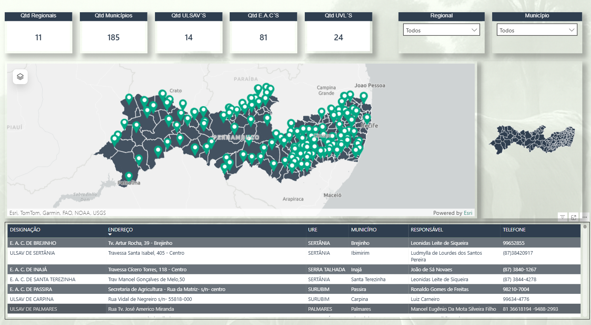

# 📊 Geo Analytics – Localização de Escritórios por Município (PE)

Dashboard desenvolvido em Power BI com foco em geolocalização e análise territorial dos escritórios no estado de Pernambuco.

---

## 📌 Problema de Negócio

A gestão não possuía uma visualização clara da distribuição geográfica dos escritórios, dificultando:

- Identificação de cobertura territorial  
- Análise de concentração por região  
- Planejamento estratégico de expansão  

---

## 💡 Solução Desenvolvida

Criação de um dashboard interativo com mapas dinâmicos permitindo:

- Visualização dos escritórios por município  
- Identificação geográfica via latitude e longitude  
- Análise por regionais (URE)  
- Navegação e filtragem dinâmica  

---

## 🏗️ Estrutura do Dashboard

O dashboard foi organizado em:

- Visão Geográfica Principal (Mapa Interativo)  
- Painel de Indicadores (KPIs)  
- Tabela Detalhada dos Escritórios  
- Filtros Dinâmicos  

---

## 📊 Indicadores

- Quantidade de Regionais  
- Quantidade de Municípios  
- Quantidade de ULSAVs  
- Quantidade de EACs  
- Quantidade de UVLs  

---

## 🧠 Insights

- Concentração maior de unidades na região litorânea  
- Distribuição desigual entre regionais  
- Identificação de áreas com menor cobertura  
- Facilidade de localização de unidades específicas  

---

## 🧭 Funcionalidades

- Mapa interativo com pontos (latitude e longitude)  
- Integração com mapa de formas (municípios de Pernambuco)  
- Filtros por regional e município  
- Interação entre mapa e tabela  
- Destaque visual das localizações  

---

## 🛠️ Tecnologias

- Power BI  
- ArcGIS Maps  
- Shape Map  
- Power Query  

---

## 🧮 Medidas DAX Utilizadas

```DAX
Qtd EAC = 
CALCULATE(
    DISTINCTCOUNT('Municípios'[DESIGNAÇÃO]),
    FILTER(
        'Municípios',
        LEFT(
            SUBSTITUTE(
                SUBSTITUTE(UPPER(TRIM('Municípios'[DESIGNAÇÃO])), ".", ""),
                " ", ""
            ),
            3
        ) = "EAC"
        &&
        NOT(ISBLANK('Municípios'[ENDEREÇO]))
    )
) + 0

Qtd ULSAV´S = 
CALCULATE(
    DISTINCTCOUNT('Municípios'[DESIGNAÇÃO]),
    FILTER(
        'Municípios',
        LEFT(
            SUBSTITUTE(
                SUBSTITUTE(
                    UPPER(TRIM('Municípios'[DESIGNAÇÃO])),
                    ".",
                    ""
                ),
                " ",
                ""
            ),
            5
        ) = "ULSAV"
        &&
        NOT(ISBLANK('Municípios'[ENDEREÇO]))
    )
) + 0

Qtd UVL = 
CALCULATE(
    DISTINCTCOUNT('Municípios'[DESIGNAÇÃO]),
    FILTER(
        'Municípios',
        LEFT(
            SUBSTITUTE(
                SUBSTITUTE(UPPER(TRIM('Municípios'[DESIGNAÇÃO])), ".", ""),
                " ", ""
            ),
            3
        ) = "UVL"
        &&
        NOT(ISBLANK('Municípios'[ENDEREÇO]))
    )
) + 0
```

---

## 🌍 Componentes Visuais

- Mapa ArcGIS com pontos de localização  
- Mapa de formas (divisão por municípios)  
- Cartões de indicadores (KPIs)  
- Tabela detalhada com dados dos escritórios  

---

## 📷 Dashboard

### Visão Geral


---
### Regional


---

### Município


---

## 🚀 Aplicação Prática

Este dashboard permite:

- Visualizar rapidamente onde estão os escritórios  
- Apoiar decisões de expansão ou redistribuição  
- Melhorar a gestão territorial do órgão  
- Facilitar consultas operacionais  

---

## 📌 Conclusão

Projeto focado em análise geoespacial, transformando dados de endereço em informação visual estratégica para tomada de decisão.

---

## 📥 Download do Projeto

O arquivo Power BI (.pbix) pode ser baixado aqui:

👉 https://github.com/valdanosimao/monitoramento-escritorios-bi/releases/download/v1.0/ESCRITORIOS_ADAGRO.pbix

...

---
